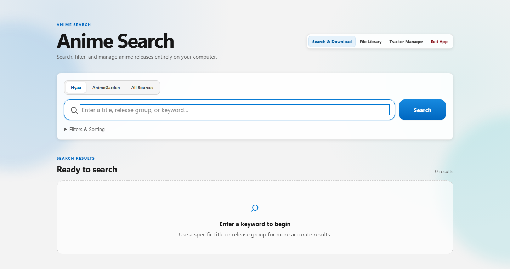
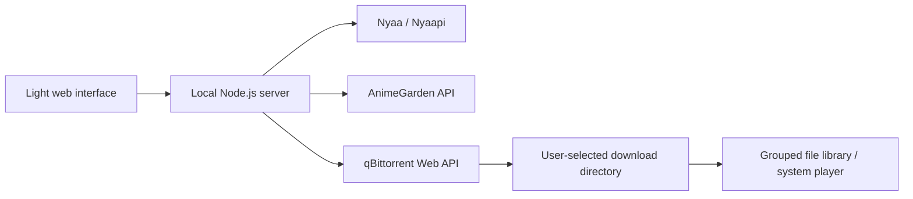

# Anime Search

[](https://github.com/CBBoos0422/anime-search-portable/actions/workflows/ci.yml)
[](LICENSE)

Anime Search is a local Windows web app for searching Nyaa and AnimeGarden, copying magnet links, and optionally managing downloads through a background qBittorrent engine. The web server and download-management API listen on the local machine only.



## Features

- Search and filter releases from Nyaa, AnimeGarden, or both sources.
- Copy magnet links or send magnet links and `.torrent` files to qBittorrent.
- Choose a download directory for each batch, monitor progress, and remove tasks together with their files.
- Group downloaded files by cleaned release title and open media with the system's default player.
- Manage Tracker lists for new and existing download tasks.
- Use a Microsoft-inspired light interface with a one-time license and lawful-use confirmation before enabling the download engine.

## Source Mode and Full Portable Edition

| Mode | Included in this repository | Runtime | Download engine |
| --- | --- | --- | --- |
| Source mode | Yes | Install Node.js 24 yourself | Search, browse, and copy magnet links immediately; downloads require a compatible qBittorrent setup |
| Full portable edition | No | Bundled Node.js 24.18.0 | Bundled qBittorrent 5.2.3 managed from the local web interface |

This repository intentionally excludes `vendor`, `node_modules`, `runtime`, build output, and third-party binaries. If a complete portable package is published, it belongs in GitHub Releases rather than Git history.

## Run from Source

Requirements: Windows 10/11 x64, Node.js 24, and npm.

```powershell
git clone https://github.com/CBBoos0422/anime-search-portable.git
cd anime-search-portable
npm ci
npm test
npm run server
```

Open <http://127.0.0.1:4173/>. If you have not prepared the download engine in source mode, choose **Not now** in the first-run prompt; search and copy features remain available.

Available commands:

- `npm start` / `npm run server`: start the source-development server.
- `npm run check`: check the syntax of every JavaScript file.
- `npm test`: run the automated test suite.
- `npm run start:portable`: start using the bundled runtime from a complete portable directory.

## Portable Build Reference

`scripts/build-portable.ps1` documents the portable build process. Before running it, prepare these files locally:

- `vendor/node/node.exe`: Node.js 24.18.0 x64.
- `vendor/qbittorrent/qbittorrent.exe`: qBittorrent 5.2.3 x64.
- `node_modules`: production dependencies installed with `npm ci --omit=dev`.
- `sources/qbittorrent-5.2.3.tar.xz`: complete source code matching the distributed binary.

The build script verifies fixed-version files with SHA-256 and produces a ZIP archive, checksum file, and package manifest. Obtain all third-party files from their official sources and follow their respective licenses.

## Architecture



The server preserves the existing HTTP API, search-result structure, and download-task data format. The qBittorrent Web API is bound to the loopback interface, and the app manages only the process it started and recorded itself.

## Source Differences

- Nyaa results can include seeders, leechers, and completed-download counts, with category, filter, and sorting options.
- AnimeGarden results include release type, publication time, and Tracker count. Its API does not provide seeder or leecher statistics, so the interface does not invent them.
- Third-party availability, content, APIs, and usage rules may change. Source-specific timeouts and connection resets are reported in the interface.

## Repository Layout

```text
app/                     Local server, web interface, and automated tests
scripts/                 Development checks, portable launcher, and build script
licenses/                Original third-party license texts
.github/workflows/       Windows / Node.js 24 continuous integration
docs/images/             README screenshots
LICENSE                  MIT license for this project
THIRD_PARTY_NOTICES.md   Third-party software and service notices
```

Runtime state, BitTorrent backups, logs, browser profiles, and WebUI credentials stay in the ignored `runtime` directory and must never be committed. Downloads are always written to a directory explicitly selected by the user. Before a directory is selected, the picker starts at **This PC**.

## Lawful Use and Privacy

Search, obtain, and share only content you are authorized to use. Follow applicable law, source-site rules, and copyright licenses. This project does not host content, does not guarantee that third-party results are lawful or available, and does not replace the user's responsibility to verify authorization.

The local service requires no cloud account. Never commit `.env`, `runtime`, download history, password hashes, logs, or personal absolute paths.

## License

Original project code is released under the [MIT License](LICENSE), copyright `CBBoos0422`. qBittorrent, Node.js, Nyaapi, and other dependencies remain under their own licenses; see [THIRD_PARTY_NOTICES.md](THIRD_PARTY_NOTICES.md) and `licenses`.
