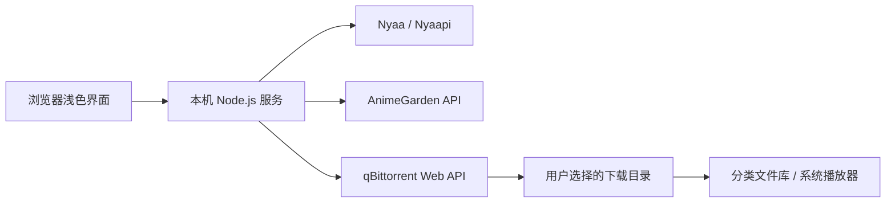

# Anime Search

[](https://github.com/CBBoos0422/anime-search-portable/actions/workflows/ci.yml)
[](LICENSE)

Anime Search 是一个面向 Windows 的本地网页工具，用统一界面搜索 Nyaa 与 AnimeGarden、复制磁力链接，并在可选的 qBittorrent 后台引擎中管理下载。网页服务和下载管理接口只在本机运行。


## 功能

- 在 Nyaa、AnimeGarden 或两个来源中搜索和筛选资源。
- 复制磁力链接，或把磁力链接、`.torrent` 文件交给 qBittorrent。
- 选择每批任务的下载目录，查看进度，并同时删除任务与磁盘文件。
- 按清理后的资源名称组织文件库，调用系统已有播放器播放文件。
- 管理新任务与现有任务的 Tracker 列表。
- 使用微软风格浅色界面；首次启用下载引擎前显示许可和合法使用确认。

## 源码参考模式与完整便携版

| 模式 | 仓库是否提供 | 运行环境 | 下载引擎 |
| --- | --- | --- | --- |
| 源码参考模式 | 是 | 自行安装 Node.js 24 | 搜索、查看和复制磁力链接可直接使用；下载功能需自行准备指定版 qBittorrent |
| 完整便携版 | 否 | 内置 Node.js 24.18.0 | 内置 qBittorrent 5.2.3，由本地网页管理 |

本仓库刻意不提交 `vendor`、`node_modules`、`runtime`、构建产物或第三方二进制文件。完整免安装包如有发布，应放在 GitHub Releases，而不是 Git 历史中。

## 从源码运行

需要 Windows 10/11 x64、Node.js 24 和 npm。

```powershell
git clone https://github.com/CBBoos0422/anime-search-portable.git
cd anime-search-portable
npm ci
npm test
npm run server
```

然后访问 <http://127.0.0.1:4173/>。源码模式下如未准备下载引擎，可在首次提示中选择“暂不启用”；搜索和复制功能仍可使用。

可用命令：

- `npm start` / `npm run server`：启动源码开发服务。
- `npm run check`：检查全部 JavaScript 文件语法。
- `npm test`：运行自动测试。
- `npm run start:portable`：使用完整便携目录中的内置运行时启动。

## 便携构建参考

`scripts/build-portable.ps1` 展示了便携包构建过程。执行前需在本地准备：

- `vendor/node/node.exe`：Node.js 24.18.0 x64。
- `vendor/qbittorrent/qbittorrent.exe`：qBittorrent 5.2.3 x64。
- `node_modules`：通过 `npm ci --omit=dev` 安装的生产依赖。
- `sources/qbittorrent-5.2.3.tar.xz`：与所分发二进制匹配的完整源代码。

构建脚本校验固定版本文件的 SHA-256，并输出 ZIP、校验文件和包内清单。第三方文件应从各自官方来源取得，并遵守对应许可证。

## 架构



服务端保留现有 HTTP API、搜索结果结构和下载任务数据格式。qBittorrent Web API 仅绑定回环地址，应用只管理由自身启动并记录的进程。

## 数据源差异

- Nyaa 结果可提供做种、下载中和完成次数等统计，并支持分类、过滤与排序。
- AnimeGarden 结果提供资源类型、发布时间和 Tracker 数量；其接口不提供做种和下载人数，因此界面不会伪造这些数据。
- 第三方站点的可用性、内容、接口和使用规则可能变化；遇到超时或连接重置时，应用会显示对应数据源错误。

## 目录结构

```text
app/                     本地服务、网页和自动测试
scripts/                 开发检查、便携启动与构建脚本
licenses/                第三方许可证原文
.github/workflows/       Windows / Node.js 24 持续集成
docs/images/             README 界面截图
LICENSE                  本项目 MIT 许可证
THIRD_PARTY_NOTICES.md   第三方软件与服务声明
```

运行状态、BT 备份、日志、浏览器配置和 WebUI 凭据保存在被忽略的 `runtime` 中，不应提交。下载文件始终写入用户明确选择的目录；未选择目录时，目录选择器从“此电脑”开始。

## 合法使用与隐私

请仅搜索、获取和分享你有权使用的内容，并遵守所在地法律、数据源规则和版权许可。本项目不托管资源，不保证第三方结果合法或可用，也不替代用户对内容授权的判断。

本地服务不需要云端账户。不要公开提交 `.env`、`runtime`、下载记录、密码哈希、日志或个人绝对路径。

## 许可证

项目原创源码采用 [MIT License](LICENSE)，版权归 `CBBoos0422`。qBittorrent、Node.js、Nyaapi 及其他依赖仍适用各自许可证，详见 [THIRD_PARTY_NOTICES.md](THIRD_PARTY_NOTICES.md) 和 `licenses`。
